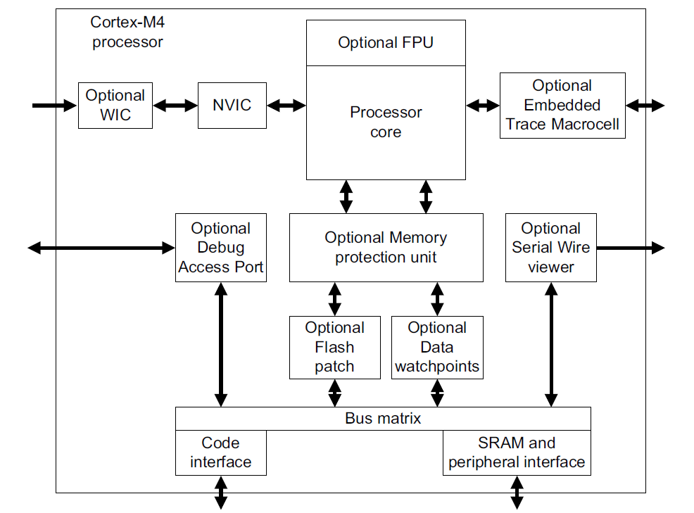

ARM Cortex Mx

It consist of 
        - A processor core 
        - Nested Vectored Interrupt Controller closely integrated with processor core for Low latency interrupt processing 
        - System Control Block
        - Memory Protection Unit ( optional)
        - Floating-point Unit

        
